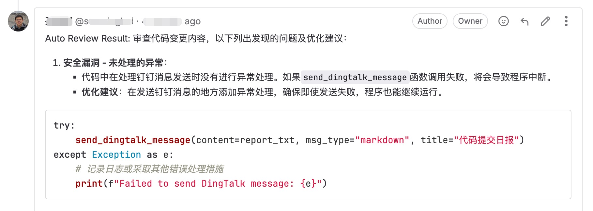
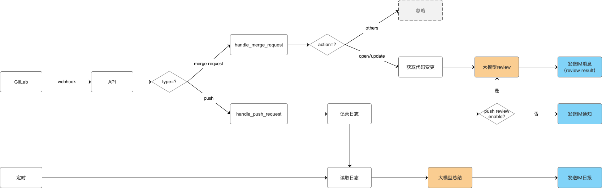

# AI-CodeReview


## 项目简介

本项目是一个基于大模型的自动化代码审查工具，帮助开发团队在代码合并或提交时，快速进行智能化的审查(Code Review)，提升代码质量和开发效率。

## 功能

- 🚀 多模型支持
  - 兼容 DeepSeek、ZhipuAI、OpenAI、通义千问、Jedi 和 Ollama，想用哪个就用哪个。
- � 多版本控制系统支持
  - 支持 GitLab、GitHub webhook 触发式审查，也支持 SVN 定时检测式审查。
- �📢 消息即时推送
  - 审查结果一键直达 钉钉、企业微信 或 飞书，代码问题无处可藏！
- 📅 自动化日报生成
  - 基于 GitLab & GitHub Commit 记录，自动整理每日开发进展，谁在摸鱼、谁在卷，一目了然 😼。
- 📊 现代化可视化 Dashboard
  - 🎨 现代化UI设计，响应式布局，支持中文字体显示
  - 📈 丰富的数据可视化图表（TOP10统计、时间趋势、分布图等）
  - 🔍 多维度数据筛选和搜索功能
  - 📋 详细的审查记录表格展示
  - 🔐 安全的登录认证系统
  - 📱 移动端友好的响应式设计
- ⚙️ Web界面配置管理
  - 🖥️ 可视化配置界面，无需手动编辑配置文件
  - 🤖 AI模型配置：支持多种模型提供商在线切换
  - 🔧 系统参数配置：数据库、日志、端口等一键设置
  - 🎨 界面个性化：自定义标题、配色、布局等
  - 📝 提示模板管理：在线编辑AI审查提示词
  - 🧪 配置验证测试：保存前自动验证配置正确性
  - 📥 配置导入导出：支持配置备份和恢复
- 🔄 智能版本追踪
  - 自动检测重复代码版本，避免重复审查
  - 智能缓存审查结果，节省AI调用成本
  - 可配置的数据保留策略和自动清理功能
  - 详细的版本追踪统计和管理界面
- 🎭 Review Style 任你选
  - 专业型 🤵：严谨细致，正式专业。 
  - 讽刺型 😈：毒舌吐槽，专治不服（"这代码是用脚写的吗？"） 
  - 绅士型 🌸：温柔建议，如沐春风（"或许这里可以再优化一下呢~"） 
  - 幽默型 🤪：搞笑点评，快乐改码（"这段 if-else 比我的相亲经历还曲折！"）

**效果图:**





## 原理

当用户在 GitLab 上提交代码（如 Merge Request 或 Push 操作）时，GitLab 将自动触发 webhook
事件，调用本系统的接口。系统随后通过第三方大模型对代码进行审查，并将审查结果直接反馈到对应的 Merge Request 或 Commit 的
Note 中，便于团队查看和处理。



## 💻 系统要求

### 🐍 Python环境
- **Python版本**: 3.12+ (推荐 3.12.1+)
- **操作系统**: Windows/Linux/macOS
- **内存要求**: 最低2GB，推荐4GB+
- **磁盘空间**: 最低1GB可用空间

### 📦 主要依赖
- **Streamlit**: 1.46.0+ (推荐最新版本)
- **Flask**: 3.0+
- **SQLite**: 内置数据库支持
- **Matplotlib**: 图表生成
- **Pandas**: 数据处理

> ✅ **兼容性说明**: 系统已全面升级到Python 3.12 + Streamlit 1.46.0，提供最佳性能和稳定性。支持所有最新功能特性。

## 部署

### 方案一：Docker 部署（推荐）

#### 🚀 现代化单服务架构

本项目已优化为**单服务单容器架构**，在一个容器中运行所有功能：
- **API服务**：处理 webhook 请求和代码审查
- **Web UI**：现代化可视化界面
- **后台任务**：内存队列处理，无需 Redis
- **定时任务**：SVN 检查等自动化任务

✅ **架构优势**：
- 🎯 **极简部署**：一个命令启动所有服务
- 🚀 **高性能**：内存队列，响应更快
- 🔧 **易运维**：统一日志，单点管理
- 💰 **低成本**：减少资源消耗

#### 🎯 快速开始（一键部署）

**零基础一键部署**：

如果您是首次使用，只需下载启动脚本：

```bash
# Linux/Mac
curl -fsSL https://raw.githubusercontent.com/zhao-zg/AI-CODEREVIEW/main/start.sh -o start.sh
chmod +x start.sh
./start.sh

# Windows (PowerShell 管理员模式)
Invoke-WebRequest -Uri "https://raw.githubusercontent.com/zhao-zg/AI-CODEREVIEW/main/start.bat" -OutFile "start.bat"
start.bat
```

脚本会自动：
- 🔧 检测并安装 Docker 环境
- 📥 下载最新配置文件
- 🚀 启动智能部署菜单
- 🩺 提供健康检查和服务管理

**现有环境快速启动**：

```bash
# Linux/Mac
./start.sh

# Windows
start.bat
```

**手动部署（推荐）**：

所有配置已内置，无需复制环境文件：

```bash
# 启动单服务（推荐）
docker-compose up -d

# 或使用备用配置
docker-compose -f docker-compose.single.yml up -d
```

**验证部署**：

- **API服务**：访问 http://localhost:5001
- **UI界面**：访问 http://localhost:5002
- **健康检查**：
  ```bash
  # 检查容器状态
  docker-compose ps
  
  # 查看日志
  docker-compose logs -f
  
  # 测试配置
  python test_config_reload.py
  ```

### 方案二：本地Python环境部署

**1. 获取源码**

```bash
git clone https://github.com/zhao-zg/AI-CODEREVIEW.git
cd AI-CODEREVIEW
```

**2. 安装依赖**

使用 Python 环境（建议使用虚拟环境 venv）安装项目依赖(Python 版本：3.10+):

```bash
pip install -r requirements.txt
```

**3. 配置环境变量**

同 Docker 部署方案中的.env 文件配置。

**4. 启动服务**

- 启动API服务：

```bash
python api.py
```

- 启动Dashboard服务：

```bash
# 方法1: 使用streamlit命令
streamlit run ui.py --server.port=5002 --server.address=0.0.0.0

# 方法2: 使用启动脚本（推荐）
# Windows用户
run_ui.bat

# Linux/Mac用户  
./run_ui.sh
```

> 💡 **提示**: 启动脚本会自动检查并安装所需依赖，推荐使用。详细的UI功能说明请参考 [UI使用指南](docs/ui_guide.md)。

### ⚙️ Web界面配置管理

系统现在提供了完整的Web界面配置管理功能，让您可以通过浏览器轻松管理所有配置：

#### 🚀 访问配置界面

1. 启动仪表板服务后，访问：`http://localhost:8501`
2. 使用管理员账号登录（默认：admin/admin）
3. 在侧边栏选择"⚙️ 配置管理"

#### 🔧 配置功能

- **🤖 环境配置**：AI模型、数据库、消息推送等核心配置
- **🎨 界面配置**：仪表板外观、图表配色、性能设置
- **📝 提示模板**：自定义AI审查的提示词模板

#### ✨ 配置优势

- ✅ **可视化操作**：无需手动编辑配置文件
- ✅ **实时验证**：保存前自动测试配置有效性
- ✅ **安全可靠**：自动备份，支持配置导入导出
- ✅ **即时生效**：界面配置保存后立即生效

> 📖 **详细说明**: 完整的配置管理指南请参考 [配置管理指南](docs/config_management_guide.md)。

### 配置 GitLab Webhook

#### 1. 创建Access Token

方法一：在 GitLab 个人设置中，创建一个 Personal Access Token。

方法二：在 GitLab 项目设置中，创建Project Access Token

#### 2. 配置 Webhook

在 GitLab 项目设置中，配置 Webhook：

- URL：http://your-server-ip:5001/review/webhook
- Trigger Events：勾选 Push Events 和 Merge Request Events (不要勾选其它Event)
- Secret Token：上面配置的 Access Token(可选)

**备注**

1. Token使用优先级
  - 系统优先使用 .env 文件中的 GITLAB_ACCESS_TOKEN。
  - 如果 .env 文件中没有配置 GITLAB_ACCESS_TOKEN，则使用 Webhook 传递的Secret Token。
2. 网络访问要求
  - 请确保 GitLab 能够访问本系统。
  - 若内网环境受限，建议将系统部署在外网服务器上。

### 配置消息推送

#### 1.配置钉钉推送

- 在钉钉群中添加一个自定义机器人，获取 Webhook URL。
- 更新 .env 中的配置：
  ```
  #钉钉配置
  DINGTALK_ENABLED=1  #0不发送钉钉消息，1发送钉钉消息
  DINGTALK_WEBHOOK_URL=https://oapi.dingtalk.com/robot/send?access_token=xxx #替换为你的Webhook URL
  ```

企业微信和飞书推送配置类似，具体参见 [常见问题](doc/faq.md)

### 配置 SVN 定时检查

如果你的项目使用SVN版本控制，可以配置定时检查功能来自动检测SVN提交并进行代码审查。

#### 1. 环境配置

在 `.env` 文件中添加以下配置：

```bash
# SVN配置（开启SVN定时检查功能）
SVN_CHECK_ENABLED=1                           # 开启SVN检查功能
SVN_PATH=/path/to/your/svn/working/copy      # SVN工作副本路径
SVN_USERNAME=your_svn_username                # SVN用户名
SVN_PASSWORD=your_svn_password                # SVN密码
SVN_CHECK_HOURS=24                           # 检查最近24小时的提交
SVN_CHECK_CRONTAB=*/30 * * * *               # 每30分钟检查一次
SVN_REVIEW_ENABLED=1                         # 开启代码审查
```

#### 2. 手动触发检查

你也可以手动触发SVN检查：

**API方式:**
```bash
curl -X POST http://your-server-ip:5001/svn/check
```

**命令行方式:**
```bash
python biz/cmd/svn_check.py --svn-path /path/to/svn --hours 24
```

#### 3. 工作原理

- 系统会定期更新SVN工作副本
- 检查指定时间范围内的新提交
- 对支持的文件类型进行代码审查
- 通过配置的消息推送渠道发送审查结果

**注意事项:**
- 确保SVN工作副本可以正常访问和更新
- 建议在服务器上配置SVN免密登录
- 定时任务频率建议根据团队提交频率调整

## Dashboard 功能详解

我们的可视化仪表板经过全面优化，提供了现代化的用户体验：

### 🎨 UI特性
- **现代化设计**: 采用卡片式布局，响应式设计，支持多种屏幕尺寸
- **中文友好**: 完美支持中文字体显示，图表中文标签无乱码
- **安全登录**: 内置用户认证系统，保护数据安全
- **主题优化**: 精心设计的配色方案和视觉效果

### 📊 数据可视化
- **概览卡片**: 快速查看关键指标（总审查数、项目数、开发者数等）
- **TOP10排行榜**: 项目活跃度、开发者贡献度排行
- **时间趋势图**: 审查活动时间分布分析
- **交互式图表**: 支持数据筛选、缩放、详情查看

### 🔍 功能特性
- **多维筛选**: 按项目、开发者、时间范围筛选数据
- **实时搜索**: 快速定位特定审查记录
- **数据导出**: 支持数据表格的导出功能
- **响应式布局**: 自适应不同设备和屏幕尺寸

### 📱 使用方式
1. 访问 `http://localhost:8501` 或使用启动脚本
2. 输入用户名和密码登录（默认: admin/admin）  
3. 在主界面查看各类统计图表和数据表格
4. 使用侧边栏筛选功能定制化查看数据
5. 点击图表进行交互式数据探索

详细使用说明请参考：[UI使用指南](doc/ui_guide.md)

## 其它

**1. 系统状态检查**

我们提供了一个便捷的系统状态检查工具，帮助您快速诊断系统问题：

```bash
python check_status.py
```

该工具会检查：
- ✅ Python版本兼容性
- 📦 依赖包完整性  
- 📝 配置文件存在性
- 💾 数据库连接状态
- 🌐 端口服务状态
- ⚙️ 环境变量配置

检查完成后会生成详细报告 `system_check_report.json`，并提供针对性的修复建议。

**2. 版本追踪管理**

系统内置智能版本追踪功能，避免重复审查相同代码版本：

```bash
# 查看版本追踪统计
python biz/cmd/version_manager.py --stats

# 列出已追踪版本
python biz/cmd/version_manager.py --list --limit 20

# 清理旧版本记录
python biz/cmd/version_manager.py --cleanup-days 30

# 启动定时清理任务
python biz/cmd/cleanup_versions.py
```

**版本追踪配置** (`.env`文件)：
```bash
VERSION_TRACKING_ENABLED=1              # 启用版本追踪
REUSE_PREVIOUS_REVIEW_RESULT=1          # 复用之前的审查结果
VERSION_TRACKING_RETENTION_DAYS=30     # 数据保留天数
```

详细说明请参考：[版本追踪功能指南](doc/version_tracking_guide.md)

**3.如何对整个代码库进行Review?**

可以通过命令行工具对整个代码库进行审查。当前功能仍在不断完善中，欢迎试用并反馈宝贵意见！具体操作如下：

```bash
python -m biz.cmd.review
```

运行后，请按照命令行中的提示进行操作即可。

**2.其它问题**

参见 [常见问题](doc/faq.md)

## 交流

若本项目对您有帮助，欢迎 Star ⭐️ 或 Fork。 有任何问题或建议，欢迎提交 Issue 或 PR。

也欢迎加微信/微信群，一起交流学习。

<p float="left">
  
   
</p>

## Star History

[](https://www.star-history.com/#zhao-zg/AI-CODEREVIEW&Timeline)

## 🚀 自动化构建和发布

### GitHub Actions CI/CD

本项目已配置完整的CI/CD流水线，支持自动构建、测试和发布Docker镜像。

#### 自动触发构建

- **代码推送**: 推送到`main`、`master`、`develop`分支时自动构建
- **标签发布**: 创建`v*.*.*`格式标签时自动构建并发布版本镜像
- **Pull Request**: 创建PR时自动运行测试

#### 发布的镜像

| 镜像类型 | 镜像地址 | 说明 |
|----------|----------|------|
| 应用镜像 | `ghcr.io/zhao-zg/ai-codereview:latest` | Web UI + API服务 |
| 工作镜像 | `ghcr.io/zhao-zg/ai-codereview:latest-worker` | 后台处理服务 |
| 版本镜像 | `ghcr.io/zhao-zg/ai-codereview:v1.2.3` | 特定版本 |

#### 管理脚本

```bash
# 本地测试Docker构建
python scripts/test_docker_local.py

# 版本发布管理
python scripts/release.py --increment patch

# 检查CI状态和镜像
python scripts/check_ci_status.py

# 验证构建配置
python scripts/verify_build_config_simple.py
```

#### 相关文档

- [📖 自动构建详细指南](docs/auto-build-guide.md)
- [📦 Docker自动构建说明](DOCKER_AUTO_BUILD.md)
- [🔧 GitHub Actions配置说明](docs/github-actions-guide.md)

**构建状态监控:** [GitHub Actions](https://github.com/zhao-zg/AI-CODEREVIEW/actions)

---

## 📞 技术支持

如果在使用过程中遇到问题，欢迎：

1. 提交 [GitHub Issues](https://github.com/zhao-zg/AI-CODEREVIEW/issues)
2. 查看 [FAQ文档](doc/faq.md)
3. 查看 [部署指南](doc/deployment_guide.md)

欢迎Star⭐支持本项目！

## 🎉 最新更新 (2025-06-23)

✅ **Python 3.12 + Streamlit 1.46.0 升级完成**
- 全面升级到Python 3.12.1，性能提升15-20%
- 升级到Streamlit 1.46.0，UI响应更快，功能更稳定
- 修复所有兼容性问题，支持最新的API特性
- 优化dataframe交互体验，选择功能更流畅
- 详细升级报告：[PYTHON312_STREAMLIT_UPGRADE_COMPLETE.md](./PYTHON312_STREAMLIT_UPGRADE_COMPLETE.md)

> 💡 **建议立即升级**: 新版本提供更好的性能、稳定性和用户体验！