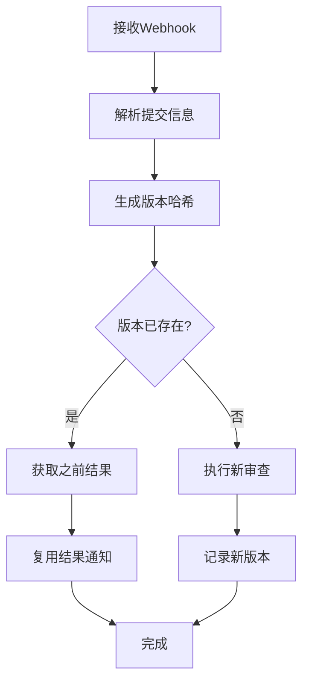

# 版本追踪功能详细说明

## 📋 功能概述

版本追踪功能是AI代码审查系统的重要组成部分，旨在避免对相同代码版本进行重复审查，提高系统效率并节省AI调用成本。

## 🎯 核心功能

### 1. 自动版本检测
- **版本哈希生成**: 基于提交信息、文件变更内容生成唯一版本标识
- **智能比较**: 自动检测相同的代码版本，避免重复处理
- **快速查询**: 通过索引优化，实现毫秒级版本查询

### 2. 审查结果复用
- **结果缓存**: 保存之前的审查结果和评分
- **智能复用**: 检测到相同版本时，可选择复用之前的审查结果
- **成本节约**: 减少不必要的AI API调用，降低运营成本

### 3. 数据管理
- **自动清理**: 定期清理过期的版本记录
- **存储优化**: 合理的数据结构设计，节省存储空间
- **性能监控**: 提供详细的统计信息和性能指标

## ⚙️ 配置说明

### 环境变量配置

在 `.env` 文件中添加以下配置：

```bash
# 版本追踪配置
VERSION_TRACKING_ENABLED=1              # 是否启用版本追踪 (1/0)
REUSE_PREVIOUS_REVIEW_RESULT=1          # 是否复用之前的审查结果 (1/0)
VERSION_TRACKING_RETENTION_DAYS=30     # 版本记录保留天数
```

### 配置项详解

| 配置项 | 默认值 | 说明 |
|--------|--------|------|
| `VERSION_TRACKING_ENABLED` | `1` | 启用版本追踪功能，设置为`0`可禁用 |
| `REUSE_PREVIOUS_REVIEW_RESULT` | `1` | 复用之前的审查结果，减少重复审查 |
| `VERSION_TRACKING_RETENTION_DAYS` | `30` | 版本记录保留天数，超过此天数的记录将被清理 |

## 🔧 使用方法

### 1. 通过UI界面

在仪表板侧边栏中找到"🔄 版本追踪"部分：

- **📊 统计概览**: 查看版本追踪的整体统计信息
- **📋 版本详情**: 浏览已追踪的版本详细信息
- **⚙️ 管理设置**: 进行版本追踪的配置和管理

### 2. 通过命令行工具

使用 `version_manager.py` 进行版本管理：

```bash
# 显示统计信息
python biz/cmd/version_manager.py --stats

# 列出版本记录
python biz/cmd/version_manager.py --list --limit 20

# 查看特定项目的版本
python biz/cmd/version_manager.py --list --project my-project

# 查看版本详细信息
python biz/cmd/version_manager.py --details abc123

# 清理旧记录
python biz/cmd/version_manager.py --cleanup-days 30

# 检查重复版本
python biz/cmd/version_manager.py --check-duplicates
```

### 3. 自动定时清理

设置定时任务自动清理旧记录：

```bash
# 启动定时清理服务
python biz/cmd/cleanup_versions.py

# 执行一次性清理
python biz/cmd/cleanup_versions.py --once
```

## 🔍 工作原理

### 版本哈希算法

版本追踪通过以下信息生成唯一哈希：

1. **提交信息**: 提交ID、消息、时间戳、作者邮箱
2. **文件变更**: 修改的文件路径和内容变更
3. **变更统计**: 新增和删除的行数

```python
# 版本哈希生成示例
version_info = {
    'commits': [
        {
            'id': 'abc123...',
            'message': 'Fix bug in user service',
            'timestamp': '2025-06-20T10:00:00Z',
            'author_email': 'developer@example.com'
        }
    ],
    'changes_count': 3,
    'file_paths': ['src/user.py', 'tests/test_user.py'],
    'changes_hash': 'def456...'
}

version_hash = sha256(json.dumps(version_info)).hexdigest()
```

### 审查流程



## 📊 数据结构

### 版本追踪表结构

```sql
CREATE TABLE version_tracker (
    id INTEGER PRIMARY KEY AUTOINCREMENT,
    project_name TEXT NOT NULL,           -- 项目名称
    version_hash TEXT NOT NULL,           -- 版本哈希
    commit_sha TEXT,                      -- 提交SHA
    author TEXT,                          -- 作者
    branch TEXT,                          -- 分支
    file_paths TEXT,                      -- 涉及文件(JSON)
    changes_hash TEXT,                    -- 变更内容哈希
    review_type TEXT,                     -- 审查类型
    reviewed_at INTEGER,                  -- 审查时间
    review_result TEXT,                   -- 审查结果
    score INTEGER,                        -- 评分
    created_at INTEGER,                   -- 创建时间
    UNIQUE(project_name, version_hash)
);
```

### 索引优化

- `idx_project_version`: 项目和版本哈希复合索引
- `idx_commit_sha`: 提交SHA索引
- `idx_changes_hash`: 变更哈希索引

## 📈 性能监控

### 关键指标

- **总版本数**: 已追踪的版本总数
- **项目覆盖**: 涉及的项目数量
- **重复率**: 重复版本的比例
- **存储效率**: 平均每条记录的存储空间

### 监控工具

1. **UI仪表板**: 实时查看统计信息
2. **命令行工具**: 定期生成报告
3. **日志监控**: 跟踪操作日志

## 🛠️ 维护指南

### 日常维护

1. **定期清理**: 建议每天或每周清理旧记录
2. **性能监控**: 关注查询响应时间和存储使用
3. **数据备份**: 定期备份重要的版本追踪数据

### 故障排除

#### 问题1: 版本哈希冲突
**症状**: 不同代码版本生成相同哈希
**解决**: 检查哈希算法实现，增加更多区分因子

#### 问题2: 查询性能下降
**症状**: 版本查询响应慢
**解决**: 
- 检查索引是否正常
- 清理过期数据
- 优化查询语句

#### 问题3: 存储空间增长过快
**症状**: 数据库文件过大
**解决**:
- 减少保留天数
- 压缩审查结果内容
- 定期清理重复记录

### 最佳实践

1. **合理设置保留期**: 根据项目活跃度调整保留天数
2. **监控重复率**: 如果重复率过低，检查哈希算法是否过于严格
3. **定期维护**: 建立定期维护计划，保持系统健康
4. **备份策略**: 制定数据备份和恢复策略

## 🔮 扩展功能

### 未来计划

- [ ] **分布式部署**: 支持多实例部署时的版本同步
- [ ] **智能学习**: 基于历史数据优化哈希算法
- [ ] **可视化分析**: 更丰富的数据分析和可视化
- [ ] **API接口**: 提供REST API供第三方系统集成

### 自定义扩展

系统提供了良好的扩展性，可以根据需要：

1. **自定义哈希算法**: 修改版本哈希生成逻辑
2. **添加新的存储后端**: 支持Redis、MongoDB等
3. **集成监控系统**: 接入Prometheus、Grafana等
4. **自定义清理策略**: 实现更复杂的数据清理逻辑

## 🤝 贡献指南

欢迎为版本追踪功能贡献代码和建议：

1. **报告问题**: 在GitHub Issues中报告bug
2. **提交改进**: 通过Pull Request提交代码改进
3. **功能建议**: 提出新功能需求和改进建议
4. **文档完善**: 帮助完善文档和使用指南

---

**版本**: v1.0  
**更新日期**: 2025年6月20日  
**维护者**: AI代码审查团队

> 💡 **提示**: 版本追踪功能可以显著提高代码审查效率，建议在生产环境中启用此功能。
